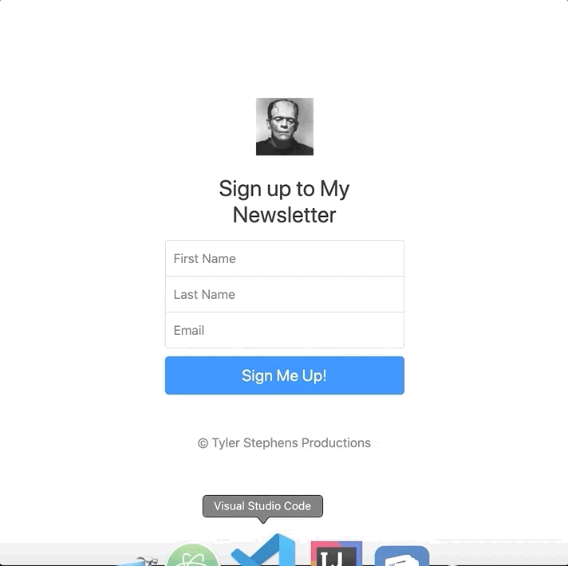

# Newsletter-Signup

Heroku Deployed Newsletter Sign-Up Application through MailChimp.

https://quiet-falls-61534.herokuapp.com/

This project learned from Dr. Angela Yu @ London App Brewery. 
This section of the course allowed me to refresh on:
* Deploying with Heroku
* Node.js
* API's
* Paths, Parameters, and Endpoints
* JSON
* HTTPS Module
* Express
* Mailchimp
